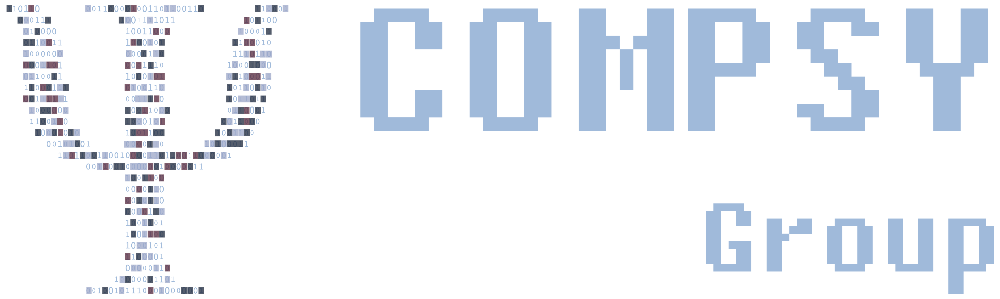

---
layout:
  width: default
  title:
    visible: false
  description:
    visible: false
  tableOfContents:
    visible: true
  outline:
    visible: true
  pagination:
    visible: true
  metadata:
    visible: false
  tags:
    visible: true
  actions:
    visible: true
---

# About

### Team

Psytag is being developed by the Computational Psychology and Psychiatry (**ComPsy**) Group at Children’s Hospital Philadelphia and the University of Pennsylvania. The core development team consists of computational scientists and engineers, psychologists and behavioral scientists, and software developers, who design, develop, implement, test, and document all tools in collaboration.

<figure><figcaption></figcaption></figure>


{% column width="58.333333333333336%" %}
<figure><figcaption></figcaption></figure>



<figure><figcaption></figcaption></figure>



### Our Funding Resources

We are actively seeking new funding opportunities to support our ongoing software development and testing efforts. If you are interested in sponsoring our work or exploring partnership opportunities, please reach out to us!

### Citations

Coming Soon&#x20;
