---
layout:
  width: default
  title:
    visible: false
  description:
    visible: false
  tableOfContents:
    visible: true
  outline:
    visible: true
  pagination:
    visible: true
  metadata:
    visible: false
  tags:
    visible: true
  actions:
    visible: true
---

# Getting Started

<h2 align="center"><strong>Getting Started</strong></h2>

Psytag is a flexible, open-source web application designed for multi-modal behavioral data labeling and annotation. The application enables structured data collection across video, audio, and image modalities using customized form layouts, event timelines, and point markers. Built-in support for multi-annotator workflows and adjudication rules ensures data quality and reliability, making Psytag an efficient platform for behavioral, social, and clinical researchers conducting human subject studies.

In this guide, we will walk through the core workflow of creating and running a project in Psytag. Let's begin by setting up a new project and configuring its layout. We first need to login the app.

<figure>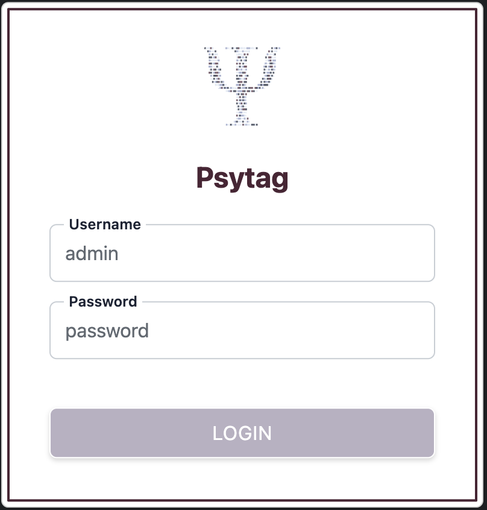<figcaption></figcaption></figure>

You can use the username you defined during the [initial setup](initial-setup.md). For the password, either enter the password you created during the initial setup (local authentication), or the password defined in the LDAP system (LDAP authentication). If your password is a temporary password given to you by the system admin, you will see the password change screen during your first login.

<figure>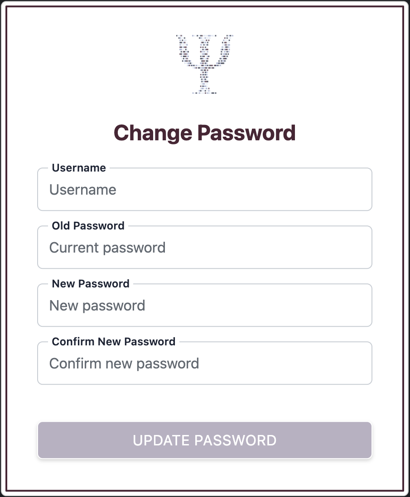<figcaption></figcaption></figure>

After you log in, you see active projects assigned to you. For example, you may be an annotator or manager. Administrators see all active projects. After initial setup, this screen is empty until you create a project.

<figure>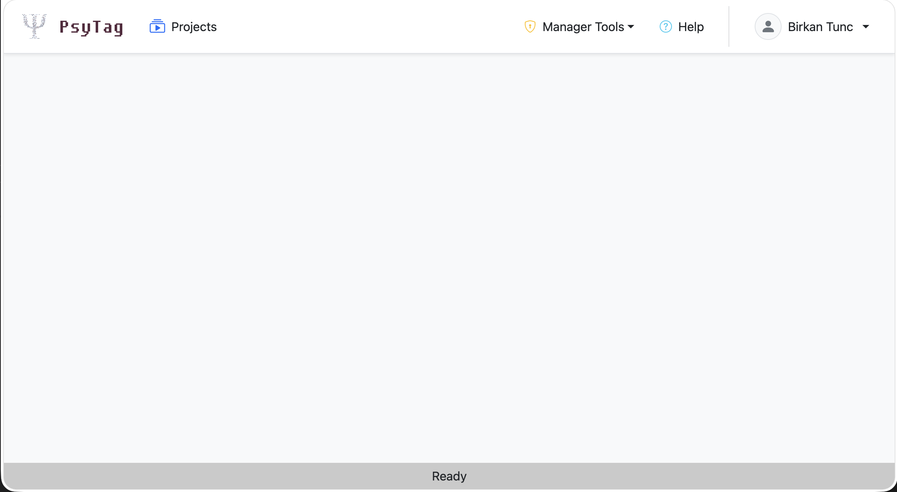<figcaption></figcaption></figure>

Let's create your first annotation project, but before doing so, it will be more convenient to add other users to Psytag first.

### User Management

When you create a project, unless you want to annotate and manage projects all by yourself, you will want to assign other users to the project as annotators and maybe as managers. In other words, you want users other than yourself defined in Psytag.

Even when you use LDAP authentication, each user still needs a Psytag account. Only users added to Psytag explicitly can access the application. To add users to Psytag, you will use the `Manager Tools` menu and select the `User Management` item.

<figure>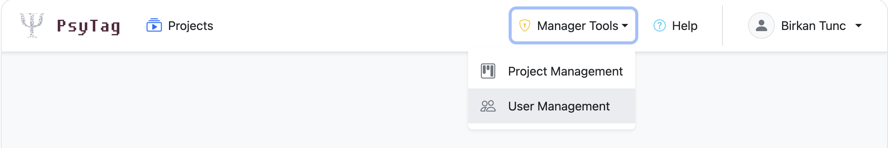<figcaption></figcaption></figure>

From there you can add new users. There three types of users in Psytag: regular users (annotators), project managers, and system admins. Project managers can create new projects and edit the projects they created. The system admins can access any projects. If you want to assign the user to one of these two categories use the corresponding toggle. For regular users, you don't need to do anything.

<figure>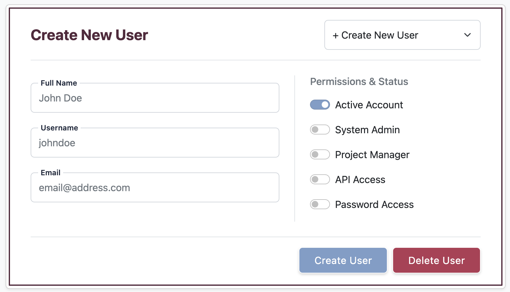<figcaption></figcaption></figure>

* **API Access** grants user access to [Python client](https://app.gitbook.com/s/lpw2Sut5Wl1gndjb4fEh/python-client). If you select this toggle, Pytag will display the generated API upon successful submission of the form. Save this key securely and share it with the user immediately, as it will not be shown again later. You can generate a new key if needed.
* **Password Access** generates a local password for the user and only necessary and effective when the authentication mode is local.

You can also edit existing users by selecting their names on the same screen.

<figure>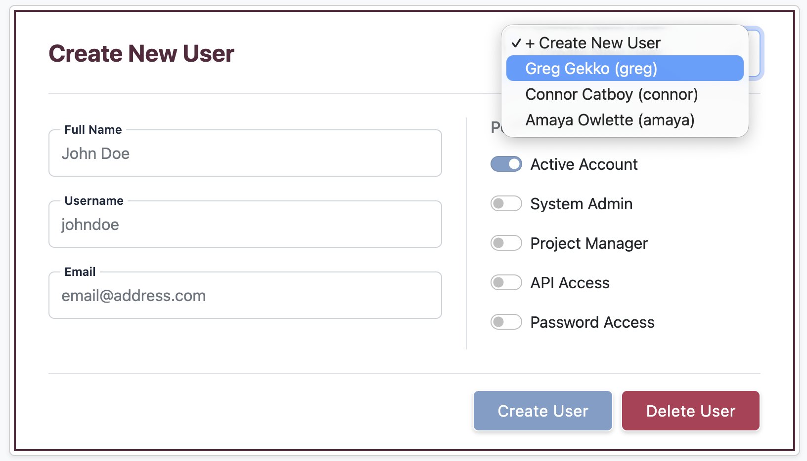<figcaption></figcaption></figure>

We can now add our first project to Psytag.

### Project Management

Use the `Manager Tools` menu and select the `Project Management` item. Note that this menu is visible only to admins and managers.

<figure>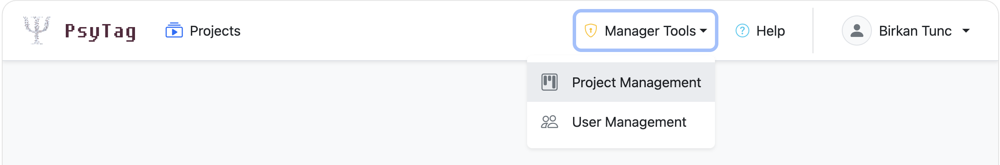<figcaption></figcaption></figure>

From there you will press the `New Project` button and start filling the basic information about the project.

#### Basic Project Information

<figure>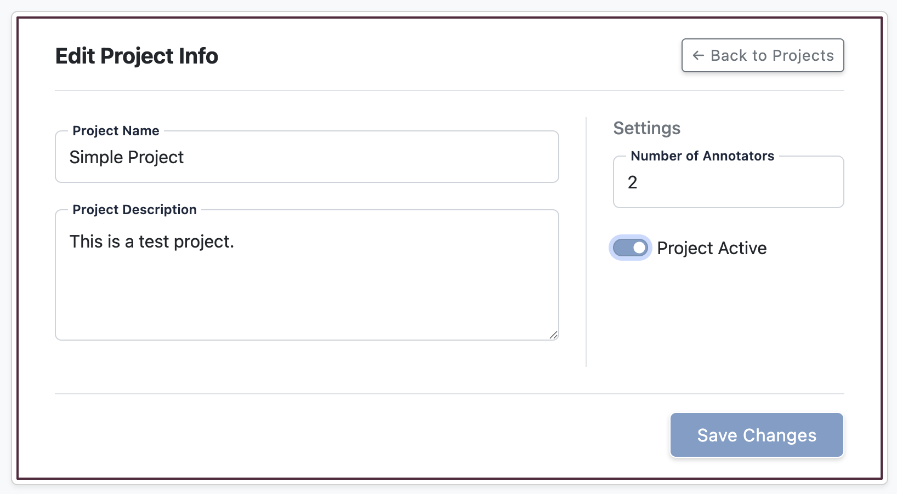<figcaption></figcaption></figure>

The `Number of Annotators` field sets the required annotations for each task. For example, enter `2` to require annotations from two distinct annotators. Psytag marks the task complete after both annotations are submitted. Save changes and press the `Back to Projects` button to see other details of the project that you can edit, including assigned users, questions, adjudication rule, and tasks.

<figure>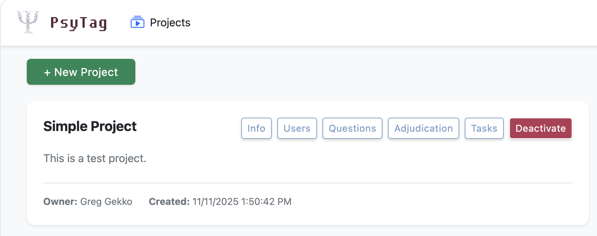<figcaption></figcaption></figure>

#### Assigned Users

When you click `Users` button on the `Project Management` screen, you can add/remove managers and annotators. You can only select from existing users in the Psytag system.

<figure>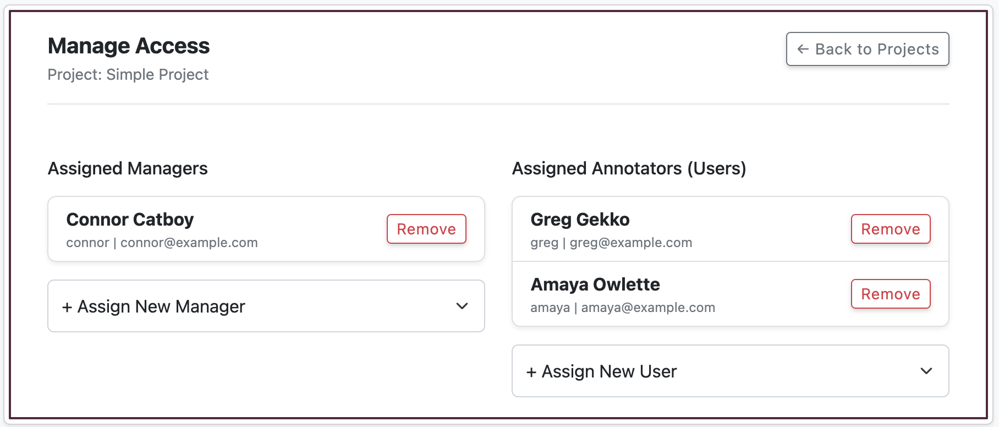<figcaption></figcaption></figure>

#### Questions

Next, you can edit the questions shown to annotators. Annotators answer questions such as “Is the video quality good?”, “Please rate the participant’s engagement in the video,” and “Please annotate the start and end times of hand gestures.” Each project task contains a single media file, such as a video or image, but you can add as many questions as needed.

When you open the question editing screen, it shows the media file thumbnail and any existing questions. The thumbnail shows where the media file appears relative to the questions.

You can enter Task Instructions that will be displayed at the top of the annotation screen.

<figure>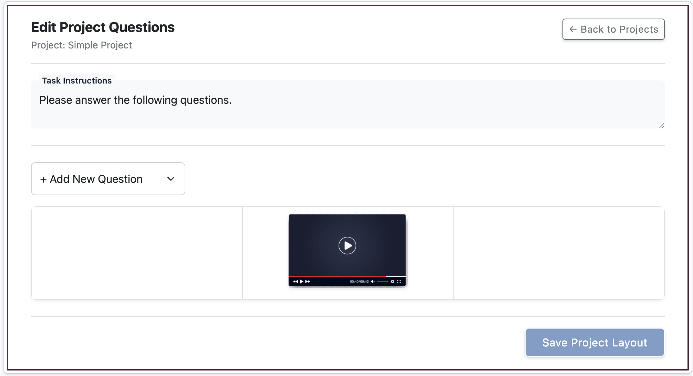<figcaption></figcaption></figure>

You can then select a new question type to add to the project.

<figure>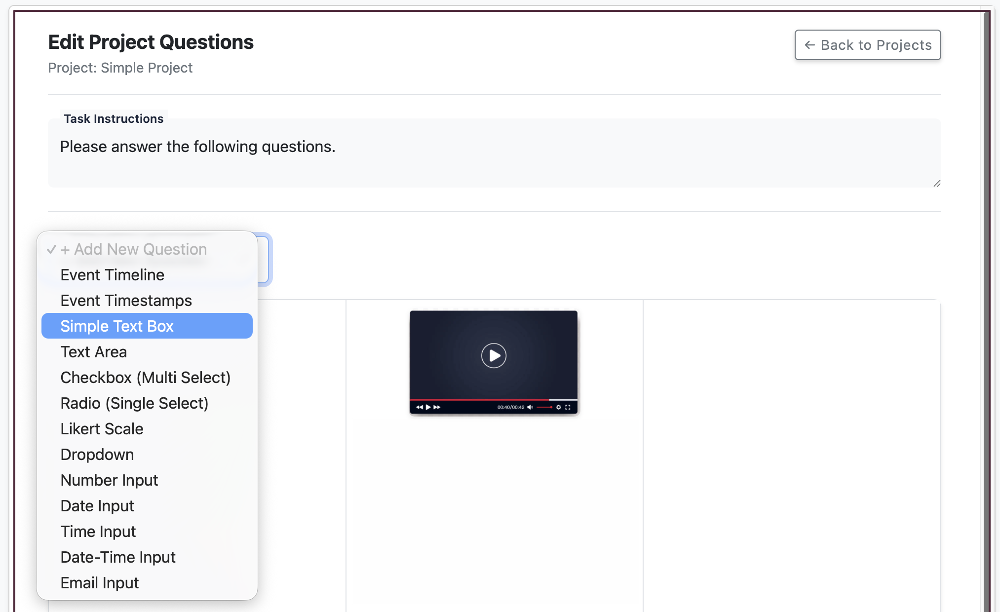<figcaption></figcaption></figure>

Most question types are regular form elements such as radio buttons, checkboxes, and range (likert scale). There are two special question types, tailored for behavioral event annotations: event timeline and event timestamps. See more details in section [Annotation Types](../psytag-fundementals/annotation-types.md).

When you add a new question, enter a variable name, question label, and whether an answer is required. The question label is the text shown to annotators (e.g., "Is the shape in the image a star or a circle?"). Depending on the question type, you may need to provide additional details, such as checkbox options or a rating range for a Likert scale.

<figure>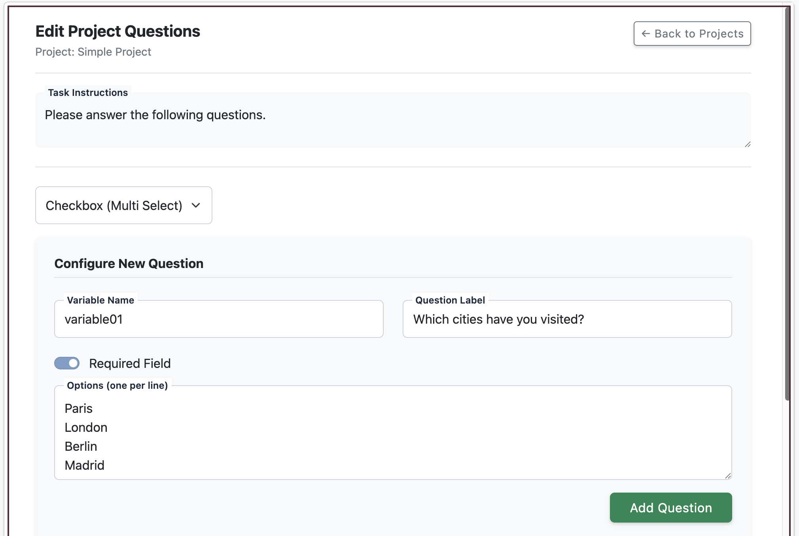<figcaption></figcaption></figure>

Added questions will be rendered below so that you can see how they will be displayed to annotators.

<figure><figcaption></figcaption></figure>

Each question includes controls to edit its details, delete it, move it up, down, left, or right.

<figure>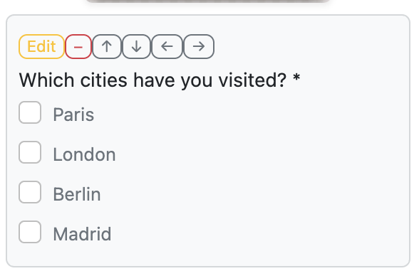<figcaption></figcaption></figure>

The question screen has three columns for displaying questions. By default, new questions appear in the center column beneath the media. Move questions left or right to control where annotators see them. The media always appears at the top of the center column and cannot be moved.

<figure>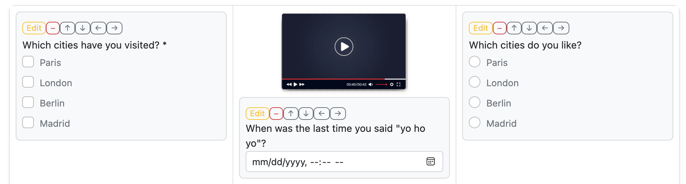<figcaption></figcaption></figure>

#### Adjudication Rule

You can define automated adjudication workflows in Psytag. These workflows rely on straightforward rules (functions) to determine when a task requires an additional annotator for adjudication. Currently, a project can have only one adjudication rule, though that rule can evaluate multiple variables at once. Keep in mind that each variable corresponds directly to a question created in your project layout.

<figure>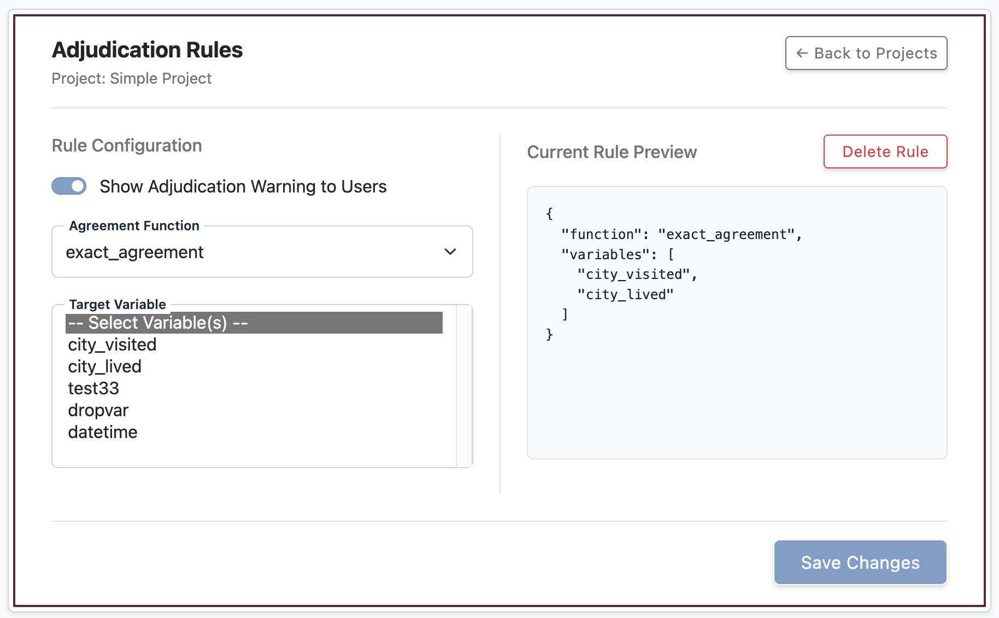<figcaption></figcaption></figure>

For example, if you choose the exact agreement rule, an adjudicator will automatically be assigned whenever two annotators do not provide identical responses for the question. Alternatively, choosing the delta agreement rule allows you to specify a numerical threshold (delta); annotations must differ by more than this tolerance level to trigger a disagreement. If you choose the always rule, a task will always be sent for adjudication regardless of the annotations.

Ensure your chosen rule aligns with the data type of the target question. For instance, applying a delta agreement rule with a numerical tolerance to a question that collects string inputs will not produce a valid workflow.

When you select multiple variables for a single rule, Psytag evaluates each variable independently. Every variable must satisfy the rule conditions simultaneously; if even one fails, the overall task is marked as a disagreement and sent for adjudication.

The `Show Adjudication Warning to Users` toggle determines whether an adjudicator is aware of their role during a task. When enabled, the adjudicator receives an explicit notification that they are reviewing previous annotations and can view those prior responses while making their final decision. When disabled, the adjudicator completes the task standardly, without any indication that it is an adjudication step or visibility into existing annotations.


Psytag does not differentiate between a regular annotator and an adjudicating annotator. That is, any assigned user can serve as an adjudicator for a task.


#### Tasks

Finally, you can add tasks to your project: the actual media files that annotators will label. You can create tasks by uploading an entire directory or by selecting individual files directly from your computer.

When you upload media files, Psytag automatically creates a distinct task for each individual file.

<figure>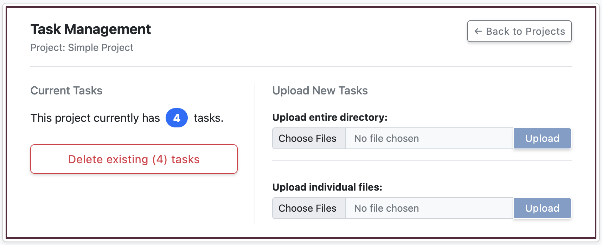<figcaption></figcaption></figure>

For advanced file operations—including alternative upload methods, using metadata, and sharing the same media assets across multiple projects—please refer to the [File Management](../psytag-fundementals/file-management.md) section.

### Annotations

Once you create a project, assign users, and add tasks, assigned annotators can log in to Psytag and view the project card on their main dashboard. For managers and administrators, a Download Annotations button is also available directly on the card, allowing them to download all current annotations for the project as a CSV file.

<figure>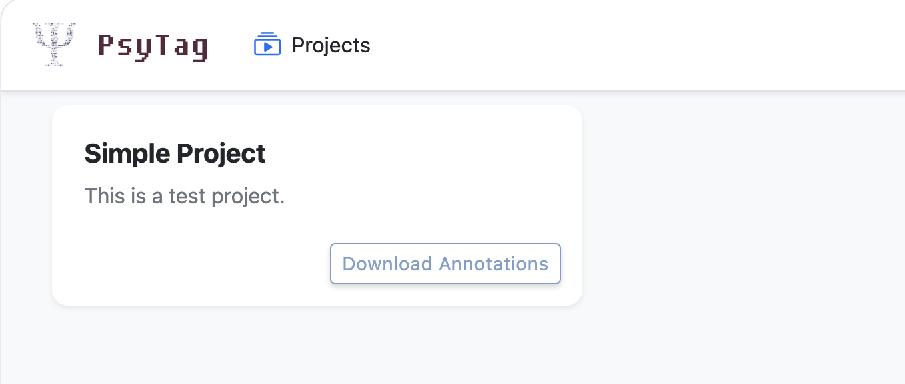<figcaption></figcaption></figure>

Clicking the project card opens the annotation screen for that project.&#x20;

<figure>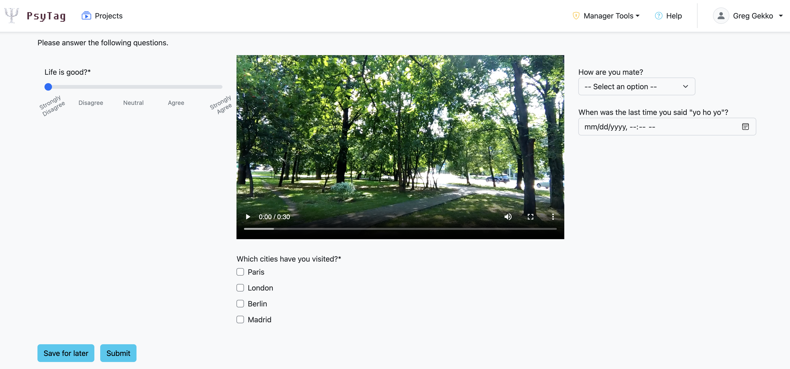<figcaption></figcaption></figure>

The annotation screen automatically presents a randomly selected task that requires labeling—such as a task that has received fewer annotations than the project's required limit, or one flagged for adjudication. The media file is rendered alongside all project questions according to your configured layout. Once the user completes the questions and clicks Submit, their responses are recorded, and the system automatically loads the next available task. If an annotator wishes to skip the current task and receive a different one, they can simply refresh their browser page, provided other eligible tasks remain in the pool.

If a task requires significant time or the annotator needs to pause their progress, they can click Save for later. This saves their partial entries while marking the annotation as incomplete. When the user returns to the project at a later time, Psytag will automatically reload this unfinished task so they can resume right where they left off.
