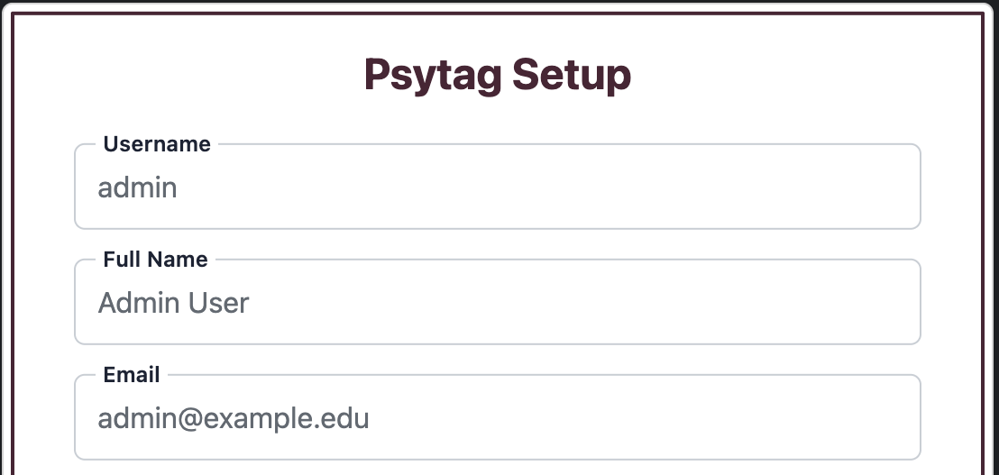
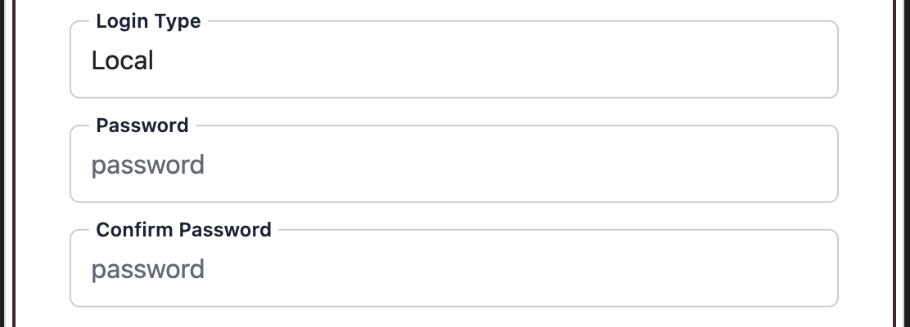
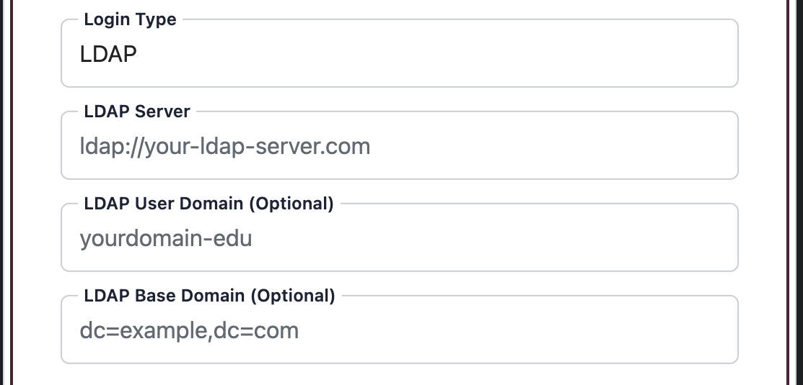
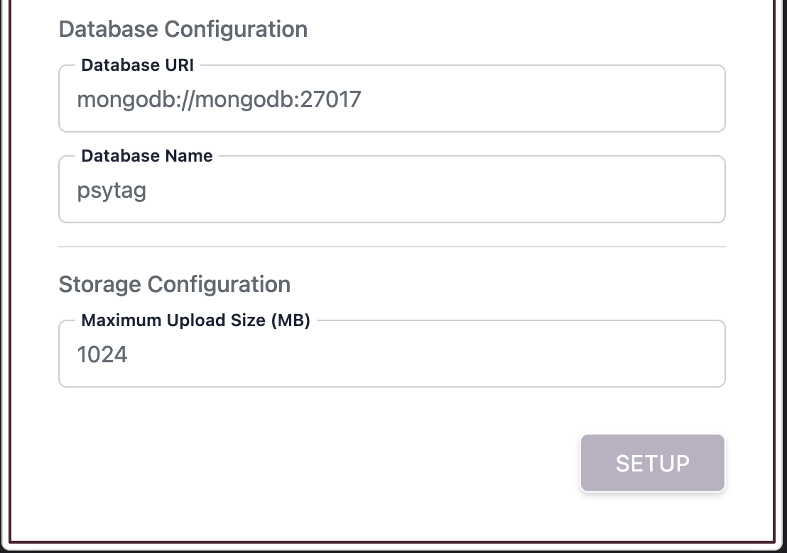

---
layout:
  width: default
  title:
    visible: false
  description:
    visible: false
  tableOfContents:
    visible: true
  outline:
    visible: true
  pagination:
    visible: true
  metadata:
    visible: false
  tags:
    visible: true
  actions:
    visible: true
---

# Initial Setup

<h2 align="center">Initial Setup</h2>

Once the [installation](installation.md) is complete, you can go ahead and start Psytag by visiting localhost:8080 (or the URL of the machine you run the frontend) on your web browser. When you do this for the first time, Psytag will ask you for some configuration details. Below are the details you need to fill in during the initial setup process.

### Account Details

Enter basic information for the primary administrator account.

* **Username**: A unique username for logging into Psytag. Must start with a letter or underscore and contain only letters, numbers, underscores, or hyphens. If you will be using LDAP authentication (see below), please make sure you enter a username that is already defined in the LDAP system.
* **Full Name**: Your full name.
* **Email**: A valid email address.

<figure><figcaption></figcaption></figure>

### Login Type Selection

Choose how users will authenticate into the application. There are two options available for now, and more are coming soon. Use Local authentication if you would like Psytag to manage user passwords directly within the application. Use LDAP if you would like to connect Psytag to your company's or enterprise's existing authentication system, such as a central directory managed by your IT department.

**Option A: Local Authentication**

Select Local if you want Psytag to manage user passwords directly.

* **Password**: Set a password for the account. Must be at least 8 characters long and include at least one uppercase letter, one lowercase letter, and one number.
* **Confirm Password**: Re-enter the password.

<figure><figcaption></figcaption></figure>

**Option B: LDAP Authentication**

Select LDAP to connect Psytag to an existing institutional user directory.&#x20;

* **LDAP Server**: The network URL of your LDAP server (e.g., `ldap://your-ldap-server.com` or `ldaps://your-ldap-server.com`).
* **LDAP User Domain (Optional)**: Your institutional domain if required for user lookup.
* **LDAP Base Domain (Optional)**: The base search domain in standard format (e.g., `dc=example,dc=com`).

Please note that with most LDAP systems, one domain info (user domain or base domain) is required.


LDAP manages user identities, but Psytag maintains a separate authentication layer. You will need to add users who need Psytag access through the Psytag User Management, described in [Getting Started ](getting-started.md)section. This is true whether you use local or LDAP authentication.


<figure><figcaption></figcaption></figure>

### Database Configuration

Specify where the MongoDB database is hosted.

* **Database URI**: The connection string for your database. Defaults to `mongodb://mongodb:27017` for standard local Docker setups. If you use free or paid [MongoDB Atlas cloud](https://www.mongodb.com/products/platform/atlas-database), you should enter the URL provided URL. Must start with `mongodb://` or `mongodb+srv://`.
* **Database Name**: The name of the database where Psytag stores its configuration and management data (defaults to `psytag`). Must contain only letters, numbers, underscores, or hyphens.

<figure><figcaption></figcaption></figure>

### Storage Configuration

Set file handling rules for media uploads.

* **Maximum Upload Size (MB)**: The maximum allowed file size for research media uploads, in megabytes. Must be a positive integer less than or equal to 3000 MB (3 GB).

### Completing Setup

1. Click the Setup button.
2. Upon successful setup, an API Key for the admin user will be generated and displayed on screen. This is an optional key that will only be necessary when using the [Python client](https://app.gitbook.com/s/lpw2Sut5Wl1gndjb4fEh/python-client) to manage the system programmatically. Copy and save this key securely in a safe place, as it will not be displayed again. You can generate a new key if you lose it.
3. Click Continue to proceed to the main login page.
