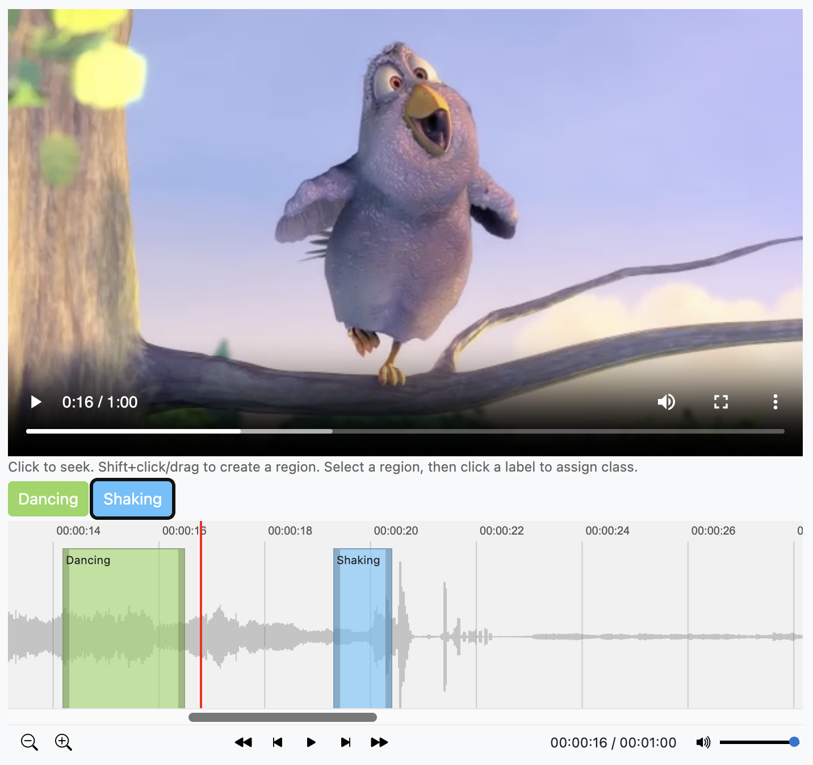
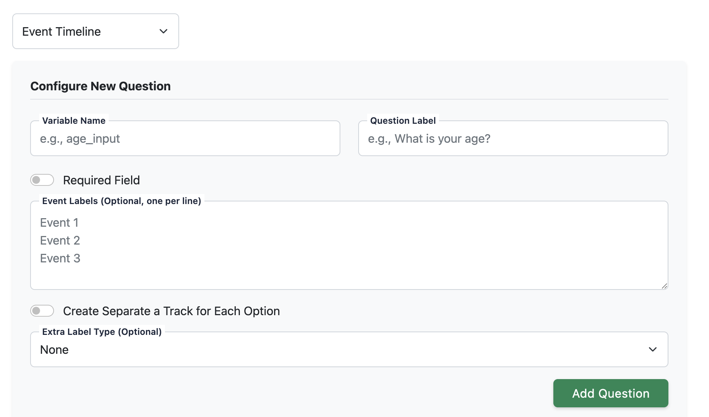
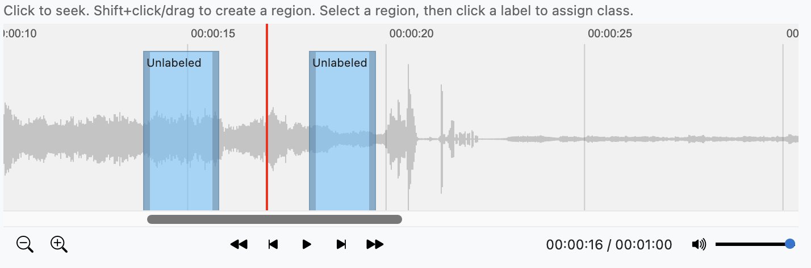
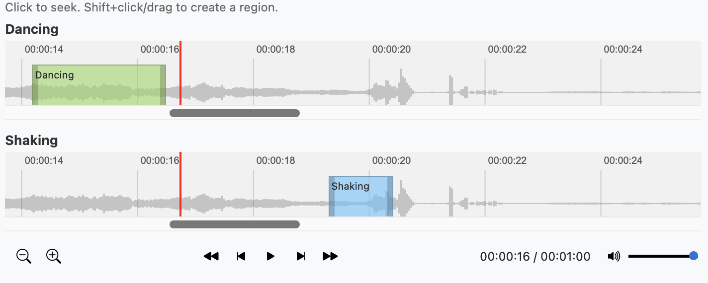
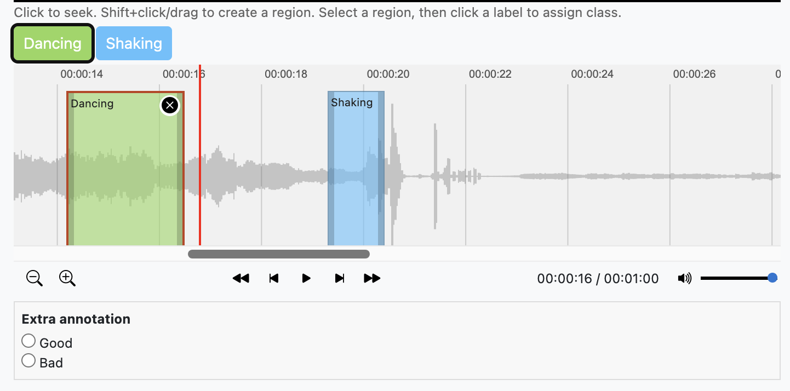
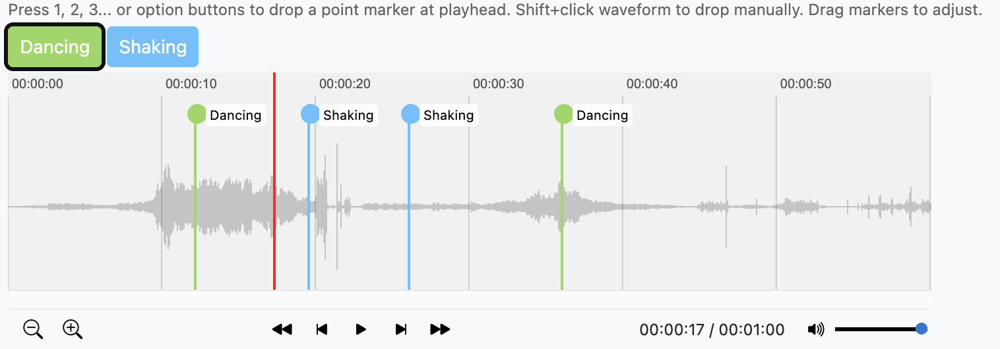

---
layout:
  width: default
  title:
    visible: false
  description:
    visible: false
  tableOfContents:
    visible: true
  outline:
    visible: true
  pagination:
    visible: true
  metadata:
    visible: false
  tags:
    visible: true
  actions:
    visible: true
---

# Annotation Types

<h2 align="center">Annotation Types</h2>

Psytag provides a variety of question types to support different research designs and data collection needs. These include standard input form elements as well as specialized interactive components designed specifically for behavioral time-series labeling.

### Standard Form Inputs

Standard form inputs allow annotators to evaluate media files using familiar survey and rating controls.

* Simple Text Box (`text`): A single-line text input field.
* Text Area (`textarea`): A multi-line text input box for longer comments, notes, or transcriptions.
* Checkbox (Multi Select) (`checkbox`): A multi-selection option list allowing annotators to select one or more applicable categories.
* Radio (Single Select) (`radio`): A single-selection option list where annotators select exactly one option.
* Likert Scale (`range`): A continuous or discrete rating slider configurable with min, max, and step values, as well as text labels.
* Dropdown (`select`): A collapsible selection menu for choosing an option from a list.
* Number Input (`number`): An input field restricted to numerical values.
* Date Input (`date`): An input field for entering dates.
* Time Input (`time`): An input field for entering time values.
* Date-Time Input (`datetime-local`): An input field for entering both date and time values.
* Email Input (`email`): An input field validated for email addresses.

### Specialized Behavioral Annotations

Psytag also includes specialized annotation interfaces built on interactive displays to support continuous behavioral coding across video and audio media.

#### Event Timeline

The Event Timeline interface (`mediatimeline`) enables annotators to mark continuous time segments (regions) along the media timeline to indicate when specific behaviors or states occur.&#x20;

<figure><figcaption></figcaption></figure>

Annotators can create regions by holding Shift and dragging across the interactive audio/video waveform. Once created, regions can be assigned categorical event labels, dragged across the timeline, or resized by dragging their left and right boundary handles.&#x20;

When adding an event timeline question to a project, you can configure several additional properties alongside the standard details, such as event labels, whether you want separate tracks for labels or not, or extra label types.&#x20;

<figure><figcaption></figcaption></figure>

Event labels are optional and can be skipped when defining the question.

<figure><figcaption></figcaption></figure>

**Multi-Track Displays**: When configured with the `separate_tracks` option, Psytag creates individual stacked waveform tracks for each classification label, allowing annotators to code overlapping behaviors independently.

<figure><figcaption></figcaption></figure>

**Secondary Extra Labels**: Timelines can be configured with an extra annotation property (`extra_labels_type`), allowing annotators to click a created segment and provide supplementary entries—such as a Likert intensity rating, sub-category, or text note—for that specific segment.

<figure><figcaption></figcaption></figure>

**Playback & Zoom Controls**: Interactive controls allow zooming in/out on fine waveform details (via keyboard, mouse wheel, or buttons) and playing back only the selected region.

#### Event Timestamps

The Event Timestamps interface (`mediatimestamp`) is designed for point-based event logging, marking exact moments in time where discrete behaviors or occurrences take place. Instead of continuous regions, event timestamps display thin vertical markers topped with color-coded flags on the waveform.&#x20;


The main difference between an event timeline and an event timestamp is that the former defines both the start and end times for an event, whereas the latter defines only a single point in time.


<figure><figcaption></figcaption></figure>

Annotators can drop point markers at the current media playhead position instantly using numerical hotkeys (keys 1 through 9) mapped to pre-defined behavioral categories. Markers can also be dropped by Shift-clicking anywhere on the waveform. Existing point markers can be dragged horizontally across the waveform to adjust their timing or assigned to new categories.
